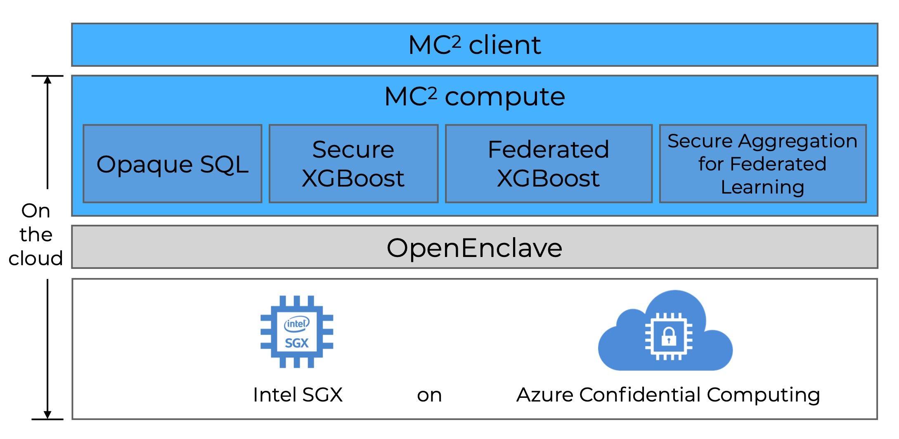

.. Opaque Client documentation master file, created by
   sphinx-quickstart on Thu Mar  4 20:37:41 2021.
   You can adapt this file completely to your liking, but it should at least
   contain the root `toctree` directive.

******************************************************************
MC\ :sup:`2`: A Platform for Secure Analytics and Machine Learning
******************************************************************

Born out of research in the `UC Berkeley RISE Lab <https://rise.cs.berkeley.edu/>`_, MC\ :sup:`2` is a platform for running secure analytics and machine learning on encrypted data. With MC2, organizations can safely upload their confidential data to the cloud in encrypted form and securely compute analytics and machine learning without exposing the unencrypted data to the cloud provider. MC2 also enables secure collaboration among multiple organizations, where the data owners can use the platform to jointly analyze their collective data without revealing their individual data to each other.

MC\ :sup:`2`'s stack supports a `single client interface <https://github.com/mc2-project/mc2-client>`_, as well as the following compute services:

- `Opaque SQL <https://github.com/mc2-project/opaque>`_: Encrypted data analytics on Spark SQL using hardware enclaves
- `Secure XGBoost <https://github.com/mc2-project/secure-xgboost>`_: Collaborative XGBoost training and inference on encrypted data using hardware enclaves
- `Federated XGBoost <https://github.com/mc2-project/federated-xgboost>`_: Collaborative XGBoost in the federated setting

           
   Overview of the MC\ :sup:`2` stack

What are secure enclaves?
=========================

In order to provide strong privacy guarantees for user data, MC\ :sup:`2` leverages secure enclaves, which are a recent advance in computer processor technology that enables the creation of a secure region of memory on an otherwise untrusted machine. Any data or software placed within the enclave is encrypted and isolated from the rest of the system. No other process on the same processor -- not even privileged software such as the OS or the hypervisor -- can access the encrypted enclave memory. 

Since the operating system is untrusted, enclaves provide a feature called *remote attestation,* which enables clients to cryptographically verify that an enclave in the cloud is running a specific version of the code. This allows remote clients to have confidence that the expected code will be executed on their data instead of a malicious piece of code. 

Examples of secure enclave technology include Intel SGX, ARM TrustZone, and AMD Memory Encryption. All major cloud providers support VMs with enclaves (see Microsoft Azure Confidential Computing, GCP Confidential Computing, and AWS Nitro enclaves).

MC\ :sup:`2` platform's workflow
================================

The MC\ :sup:`2` platform builds upon the Open Enclave SDK, an open source SDK that provides a single unified abstraction across different enclave technologies. The use of Open Enclave enables our library to be compatible with many different enclave backends, including Intel SGX.

The diagrams below show a sample workflow of a user using MC\ :sup:`2` for secure data processing in a cloud. Green indicates a trusted component, while read indicates an untrusted component that could be compromised by an adversary.

1. A user first uses our MC\ :sup:`2` client software to encrypt and upload their data to untrusted cloud storage.

   .. figure:: mc2_workflow/mc2_workflow.001.jpeg
      :figwidth: 85 %
      :align: center

2. Next, the user executes remote attestation to load MC\ :sup:`2` compute service into enclaves and transfers their private keys to our service.

   .. figure:: mc2_workflow/mc2_workflow.002.jpeg
      :figwidth: 85 %
      :align: center

3. The user is ready to issue compute tasks to an untrusted orchestrator. The orchestrator will forward the requests to the enclave compute service, which will read the relevant encrypted data from the untrusted storage, decrypt it inside the enclave environment using the user's private key, and run the user-specified compute tasks.

   .. figure:: mc2_workflow/mc2_workflow.003.jpeg
      :figwidth: 85 %
      :align: center

4. Finally, the result returned to the user in encrypted form, which can be decrypted locally by the user.

   .. figure:: mc2_workflow/mc2_workflow.004.jpeg
      :figwidth: 85 %
      :align: center

              
.. toctree::
    :maxdepth: 2
    :caption: Contents:

    Opaque SQL <https://mc2-project.github.io/opaque-sql/>
    Secure XGBoost <https://mc2-project.github.io/secure-xgboost/>
    Federated XGBoost <https://github.com/mc2-project/federated-xgboost>
